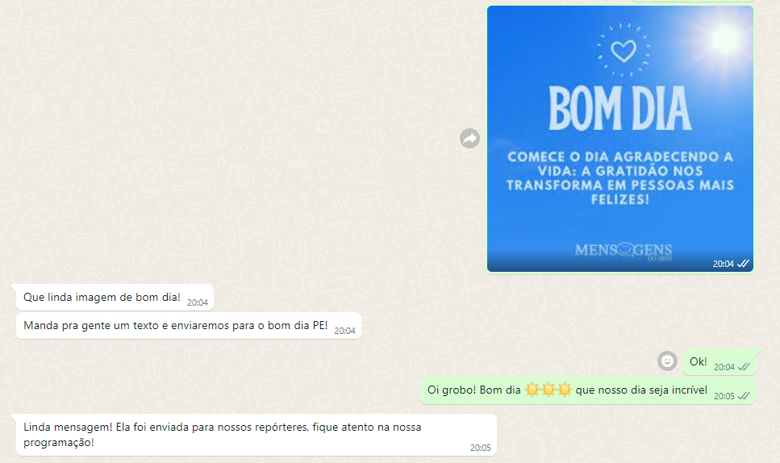
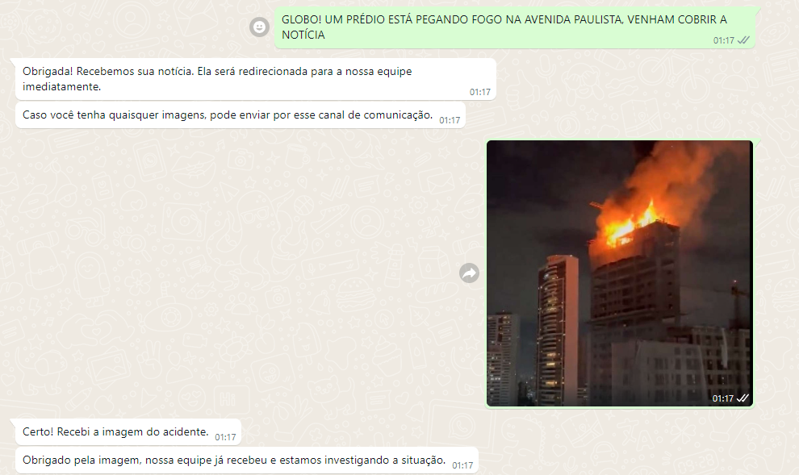
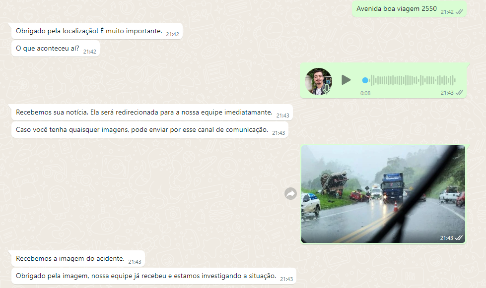
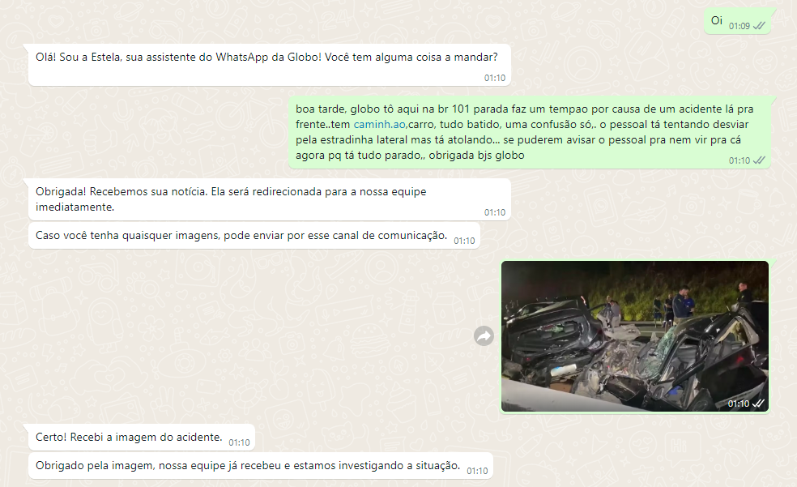

# Colaborativo! Uma edição do colaboratório

## Como funciona nosso algoritmo?

Nos baseamos em *filtros* para poder:
  - Eliminar conteúdo indesejado (NSFW, mensagens de ódio e spam)
  - Classificar as imagens/mensagens/áudio recebidos (notícias urgentes, bom dia, sugestões de reportagem, etc.)
  - Adicionar um valor de credibilidade na notícia (verificar possibilidade de ser uma fake news)

## Como fazemos isso?

Nesse repositório, você vai encontrar *dois* tipos de IA's diferentes: NLP's e CNN's.

### O que é uma NLP?

NLP (Processamento de Linguagem Natural) é uma tecnologia de IA que permite que as máquinas entendam e processem a linguagem humana. Utilizamos a NLP para analisar mensagens de texto enviadas pelos usuários, identificando, por exemplo, saudações, notícias urgentes, sugestões de reportagens e mensagens de ódio. Ela também contribui para verificar o teor das mensagens, ajudando na detecção de possíveis fake news por meio de análise contextual e palavras-chave.

### O que é uma CNN?

CNN (Rede Neural Convolucional) é uma arquitetura de rede neural especialmente eficaz para processar dados visuais, como imagens. Neste projeto, usamos uma CNN para classificar as imagens recebidas, detectando conteúdos inapropriados (NSFW), identificando eventos como incêndios ou acidentes e verificando a autenticidade da imagem. As CNNs são treinadas em grandes bases de dados visuais para identificar padrões específicos e podem diferenciar entre uma imagem de notícia urgente e conteúdo irrelevante.

### Modelos prontos e criados

Nós criamos os modelos classificatórios, já que são bem mais específicos e adaptados para as necessidades do projeto. Além disso, utilizamos um modelo pré-treinado de código aberto chamado <a href='https://github.com/dsprabowo/nsfw-detector'>nsfw-detector</a> para a detecção de conteúdo NSFW, economizando tempo e recursos no treinamento específico para esse tipo de filtragem.

## Features

Como principais features, nós temos:

  - **Clusterização de mensagens de texto:** Agrupamos mensagens semelhantes para simplificar a triagem e análise, facilitando a resposta rápida a temas semelhantes.
  - **Classificação de imagens recebidas:** Nossa CNN avalia e classifica as imagens com base no conteúdo (por exemplo, acidentes, incêndios), auxiliando no redirecionamento de informações relevantes para as equipes.
  - **Detecção de NSFW e imagens possivelmente alteradas:** Protege a plataforma contra conteúdo inapropriado e manipulados digitalmente.
  - **TTS: compreensão de áudios:** O sistema consegue interpretar mensagens de áudio, convertendo-as em texto para análise e categorização, melhorando o suporte a múltiplos formatos de envio.
  - **Identidade visual aprimorada e bem definida:** Interface amigável e de fácil navegação para que usuários possam interagir com a assistente Estela.
  - **Backend de ponta a ponta:** O sistema é integrado desde o recebimento e categorização das mensagens até a geração de relatórios ou documentos que são encaminhados ao colaborativo.

# TUDO ISSO FOI FEITO EM 2 DIAS!!!

Esse é o nosso projeto para o Globo Challange 3.0, um hackaton que aconteceu durante o Rec'N Play!

# Imagens de atendimentos:

